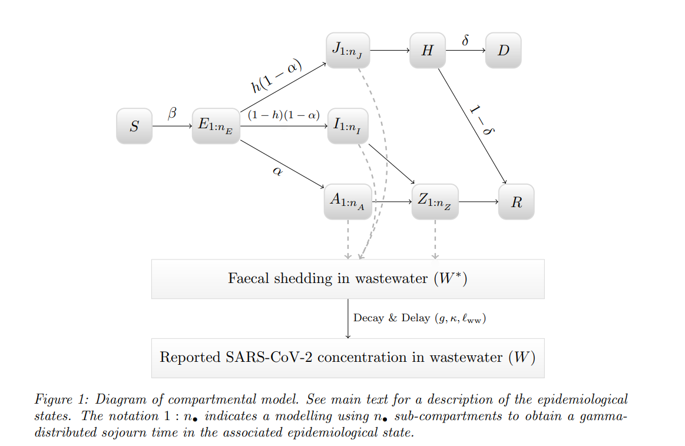

```{r, include = FALSE}
knitr::opts_chunk$set(
  collapse = TRUE,
  comment = "#>"
)
```

```{r setup, echo = FALSE, message = FALSE, warning = FALSE}
library(ern)

library(tibble)
library(tidyr)
library(dplyr)
library(ggplot2)
```

[Jump to estimated parameter values](#sec-params) 

In order to calculate Rt from clinical reports or wastewater concentration, we need to assume a few quantities, including a generation interval distribution. The generation interval is the time between consecutive infections. Once we have a generation interval distribution, we can take a daily incidence time series and use it to estimate a daily $\mathcal{R}_t$ time series by deconvolving incidence with the generation interval distribution using the R package `EpiEstim`.

In order to estimate incidence, we need a few more pieces of information depending on the primary data source. For clinical case reports, we additionally need an incubation time distribution, which gives the time between infection and symptom onset, and a reporting delay distribution, which gives the time between symptom onset and a case report. For wastewater concentration, we need a fecal shedding distribution, which describes how individuals shed viral particles into wastewater over time during an infection.

This vignette focuses on quantifying families of distributions for the generation interval, incubation period, and fecal shedding. 

## Generation interval and incubation period distributions

Here, we give an example on estimating the different distributions for COVID-19 in Canada. The same approach may be used for other pathogens in different jurisdictions.

### Available data

For COVID-19 in Canada, the most relevant distribution estimates come from analyzing Omicron infection data as the majority of lineages circulating in the country since January 2021 have been descendants of Omicron. (Manica _et al._ 2022) assume both the incubation period and generation interval are gamma distributed, and then they use Omicron infection data to estimate distribution parameters for each quantity, along with measures of uncertainty for each parameter. (Note that Manica _et al._ estimate distributions for two different generation intervals but we will use the **intrinsic generation interval**)

```{r manica-table, echo = FALSE, fig.align="center", fig.cap='**Table 2 from (Manica _et al._ 2022)**. Original caption: "Estimates for the incubation period, diagnostic delay, intrinsic and realized generation time, and household serial intervals of the SARS-CoV-2 Omicron variant. Reported parameters of shape and scale for the incubation period and intrinsic generation time refer to a gamma distribution. Estimates of the incubation period are dervied from the analysis of 80 participants to a single superspreading event in Norway. Data taken from Brandal _et al_."'}
knitr::include_graphics("figs/manica-table.png",
                        dpi = 144)
```


Manica _et al._ give estimates for the mean, shape, and scale parameters of each family of (gamma) distributions (Figure \@ref(fig:manica-table)). However, **the uncertainty in each estimated parameter is reported in terms of a credible interval**, *i.e.* in a non-parametric way. We need each family of distributions to be specified in a _parameteric_ way, because of how the package `ern` computes $\mathcal{R}_t$ with various sources of uncertainty, in particular the distribution uncertainty (i.e., we are not fully certain of the distribution to use).  Hence, `ern` generates an ensemble of simulations for the $\mathcal{R}_t$ time series, where for each individual simulation, we draw from the specified families of distributions (among other quantities) to select one distribution of each type to use for that specific  $\mathcal{R}_t$ calculation.

The following section describes how we generated parametric specifications for the families of generation interval and incubation period distributions from the non-parameteric uncertainties given by Manica _et al._

### Parameterizing families of distributions from non-parametric uncertainties

We will specify each family of gamma distributions with a mean and shape parameter (the "distribution parameters"), along with standard deviations about each of these two parameters. 

We assume that each distribution parameter is itself gamma distributed. The mean of this distribution is assumed to be the corresponding mean value listed in Figure \@ref(fig:manica-table). In order to estimate a standard deviation for this distribution, we assume that the credible interval bounds give quantiles and use them, along with a mean (equal to the mean estimate of the focal parameter) to fit shape parameter for a gamma distribution. Once we have the fitted shape parameter, we can calculate the corresponding standard deviation. 

For each family of gamma distributions, we need to fit distributions as described above over **two** parameters to specify it. We will perform two independent one-dimensional optimizations of the shape parameter for the distributions of the mean and the shape parameter of each gamma family.

The following code defines a function (`fit_sd()`) to perform the aforementioned one-dimensional optimization:

```{r optim}
# Fit a standard deviation for a gamma distribution
# given a mean and 95% quantiles
fit_sd <- function(mean, ci){
  
  # Score function for optimization
  # s = shape
  # m = assumed mean
  # ci_target = the 95% credible interval bounds, assumed to be 2.5% and 97.5% quantiles
  score_fun <- function(s, m, ci_target) {
    shape <- s
    scale <- m/s
    ci <- qgamma(c(0.025, 0.975), shape = shape, scale = scale)
    return(sum((ci-ci_target)^2))
  }

  # Optimize over shape
  opt_out <- optim(
    par = 1, 
    fn = score_fun,
    m = mean,
    ci_target = ci,
    lower = 0.0001, upper = 1000,
    method = "Brent"
  )
  
  # Get best shape parameter found and return associated standard deviation
  shape_best <- opt_out$par
  sd_best <- shape_to_sd(shape_best, mean)
  
  return(list(
    sd = sd_best,
    score = opt_out$value
  ))
}

# Helper function to compute a gamma's standard deviation given the shape and mean
shape_to_sd <- function(shape, mean) mean/sqrt(shape)
```

### Fitted parameter values 

We use the method above to generate fitted parameter values for each family of distributions, which are encoded in `ern::def_dist_generation_interval(pathogen = "sarscov2")` and `ern::def_dist_incubation_period(pathogen = "sarscov2")`. The parameters are summarised here in Tables \@ref(tab:table-gen-int) (generation interval) and \@ref(tab:table-inc-per) (incubation period).

```{r make_fit_table, echo = FALSE}
#' Make table summarizing parameters for each family of distributions
#'
#' @param mean.inputs list with elements `mean` (scalar) and `ci` (numeric vector of length 2) 
#' @param shape.inputs same format as `mean.inputs`
#'
#' @return tibble 
make_summary_table <- function(mean.inputs, shape.inputs){

  fit.mean <- fit_sd(mean = mean.inputs$mean, ci = mean.inputs$ci)
  fit.shape <- fit_sd(mean = shape.inputs$mean, ci = shape.inputs$ci)
  
  tb <- tribble(
    ~parameter,           ~`value type`,        ~origin,    ~`value`,
    "distribution mean",  "mean",               "assumed",  mean.inputs$mean,
    NA,                   "standard deviation", "fitted",   fit.mean$sd,
    "distribution shape", "mean",               "assumed",  shape.inputs$mean,
    NA,                   "standard deviation", "fitted",   fit.shape$sd,
  )
}
```

```{r display_table, echo = FALSE}
display_table <- function(tb, caption = "", digits = 4){
  knitr::kable(
    tb |> mutate(
    across(where(is.character), ~replace_na(.x, ""))
  ), 
    digits = digits,
    caption = caption
  )
}
```

```{r table-gen-int, echo = FALSE}
summary.gen.int <- make_summary_table(
  mean.inputs = list(
    mean = 6.84,
    ci = c(5.72, 8.60)
  ),
  shape.inputs = list(
    mean = 2.39,
    ci = c(2.01, 3.34)
  )
)

display_table(summary.gen.int,
              caption = "Parameters for the family of generation interval distributions")
```

```{r table-inc-per, echo = FALSE}
summary.inc.per <- make_summary_table(
  mean.inputs = list(
    mean = 3.49,
    ci = c(3.19, 3.77)
  ),
  shape.inputs = list(
    mean = 8.50,
    ci = c(6.14, 13.20)
  )
)

display_table(summary.inc.per,
              caption = "Parameters for the family of incubation period distributions")
```

The mean fitted distributions (that is, the distributions generated by taking the mean distribution mean and mean shape parameter) are illustrated in Figures \@ref(fig:plot-mean-gen-int) (generation interval) and \@ref(fig:plot-mean-inc-per) (incubation period).

```{r plot_mean_dist, echo = FALSE}
plot_mean_dist <- function(summary, max, title){
  summary <- fill(summary, parameter)
  mean = (summary 
    |> filter(parameter == "distribution mean",
               `value type` == "mean")
    |> pull(value)
  )
  shape = (summary 
    |> filter(parameter == "distribution shape",
               `value type` == "mean")
    |> pull(value)
  )
  
  y <- get_discrete_dist(list(
    dist = "gamma",
    mean = mean,
    mean_sd = NA,
    shape = shape,
    shape_sd = NA,
    max = max
  ))
  
  df <- tibble(x = 1:max, y = y)
  
  (ggplot(df,
          aes(x = x, y = y))
    + geom_col()
    + scale_x_continuous(breaks = 1:max,
                         expand = expansion(mult = 0))
    + scale_y_continuous(expand = expansion(mult = c(0, 0.05)))
    + labs(x = "days",
           title = title)
    + theme_bw()
    + theme(
      axis.title.y = element_blank(),
      text = element_text(size = 12)
    )
  )
}
```

```{r plot-mean-gen-int, echo = FALSE, fig.width = 4, fig.height = 2.5, fig.cap = "Generation interval distribution for the mean value of the mean and shape parameter"}
plot_mean_dist(summary.gen.int, max = 21,
               title = "Mean generation interval distribution")
```

```{r plot-mean-inc-per, echo = FALSE, fig.width = 4, fig.height = 2.5, fig.cap = "Incubation period distribution for the mean value of the mean and shape parameter"}
plot_mean_dist(summary.inc.per, max = 8, 
               title = "Mean incubation period distribution")
```

## Fecal shedding distribution

Viral concentration in wastewater has become a popular metric in tracking community transmission of respiratory illnesses. Infected individuals shed viral particles in their stools, which end up in wastewater. Wastewater samples are then tested for viral concentration. Daily changes of viral concentration allow modellers to examine trends and estimate the effective reproductive number ($R_t$) over time.

### Estimating $R_t$ from wastewater {#sec-est-Rt}

The process we use to estimate $R_t$ from viral concentration in wastewater in the package `ern` is as follows:

1.  Pre-process the **time series of viral concentration in wastewater** to prepare for computing $R_t$. This step involves smoothing the rather noisy viral concentration data, as well as mapping from viral concentration to numbers of infections using a scaling factor.

2.  Specify a **fecal shedding distribution** which describes how infected individuals shed viral particles into wastewater over time. This article focuses on how a family of fecal shedding distributions were estimated for `ern` from literature.

3.  Perform a deconvolution of the pre-processed viral concentration time series using the fecal shedding distribution in order to obtain a **daily incidence time series** (see (Huisman _et al_)).

4.  Specify a **generation interval distribution**, which describes the time interval between an individual's infection and their transmission to another person. The way in which parameters for the family of generation intervals used in `ern` are estimated is described in the `distributions` vignette.

5.  Perform a deconvolution of the daily incidence time series with the generation interval distribution to obtain the $R_t$ **time series** using the R package `EpiEstim`.

### Fecal shedding kinetics

Individuals infected with respiratory illnesses (such as SARS-CoV-2, influenza, and RSV) shed viral particles into wastewater through their stool. In order to estimate the fecal shedding distributions needed for the $R_t$ calculation described [above](#sec-est-Rt), we must assume a model for the fecal shedding kinetics, which refers to the change of the individual's shedding amount in stools as a function of time since infection.

Research has been done to understand fecal shedding kinetics. In (Nourbakhsh _et al._ 2021), a SEIR compartmental model was created to simulate and forecast SARS-CoV-2 viral concentration in wastewater. In this model, SARS-CoV-2 fecal shedding in wastewater comes from individuals of different clinical profiles: infectious symptomatic (denoted as $I$), infectious asymptomatic (denoted as $A$), infectious symptomatic that requires hospitalization (denoted as $J$), and noninfectious (denoted as $Z$). A diagram illustrating how individuals move through the compartmental model and contribute to wastewater fecal shedding is shown below.

{width="90%"}

In this diagram, individuals begin in the susceptible compartment ($S$). Once exposed to SARS-CoV-2, they move into the exposed compartment ($E$) where they can then move into 3 unique compartments: infectious symptomatic ($I$), infectious asymptomatic ($A$), and infectious symptomatic that requires hospitalization ($J$). Individuals in the $I$ and $A$ compartments contribute to fecal shedding in their respective compartments along with when they enter the noninfectious compartment ($Z$). Individuals in the $J$ compartment do not enter into the $Z$ compartment as it is inferred that they do not contribute to fecal shedding while hospitalized ($H$). See (Nourbakhsh *et al.* 2021) for more details on the compartment model.

### Fitting a distribution based on fecal shedding kinetics

Within each of the 4 compartments that contribute to fecal shedding lies a number of subcompartments of $n_c$ (c: compartment name). According to (Nourbakhsh *et al.* 2021), each subcompartment sheds a different amount of viral SARS-CoV-2 into wastewater. The following figures illustrate the log fecal shedding kinetics of individuals in $I$, $A$, $J$, and $Z$ compartments.

```{r, echo=FALSE, fig.width = 6, fig.height = 4}
shed.i = data.frame(
  x = seq(from = 1, to = 12, by = 2),
  y = c(5, 7.30103, 7.083333, 6.677121, 6.30, 5.9)
)

plot(x = shed.i$x,
     y = shed.i$y,
     "b",
     main = "Fecal shedding kinetics: I compartment.\nMean days of shedding: 12",
     xlab = "days",
     ylab = "log viral load")

shed.a = data.frame(
  x = seq(from = 1, to = 10, by = 2),
  y = c(5,7.30103,7.083333,6.677121, 6.30)
)
plot(x = shed.a$x,
     y = shed.a$y,
     "b",
     main = "Fecal shedding kinetics: A compartment.\nMean days of shedding: 10",
     xlab = "days",
     ylab = "log viral load")

shed.j = data.frame(
  x = seq(from = 1, to = 8, by = 2),
  y = c(5,7.30103,7.083333,6.677121)
)
plot(x = shed.j$x,
     y = shed.j$y,
     "b",
     main = "Fecal shedding kinetics: J compartment.\nMean days of shedding: 8",
     xlab = "days",
     ylab = "log viral load")

shed.z = data.frame(
  x = seq(from = 1, to = 24, by = 4),
  y = c(5.40103,4.60103,3.90103,3.10103,2.10103,1.2)
)
plot(x = shed.z$x,
     y = shed.z$y,
     "b",
     main = "Fecal shedding kinetics: Z compartment.\nMean days of shedding: 24",
     xlab = "days",
     ylab = "log viral load")
```

Using these fecal shedding kinetics values for the 4 compartments, a general fecal shedding distribution for SARS-CoV-2 can be estimated for `ern` . This is first done by creating dataframes representing the various fecal shedding profiles of individuals exposed to SARS-CoV-2 ($I$ + $Z$, $A$ + $Z$, $J$).

```{r}
shed.symp = data.frame(
  x = c(seq(from = 1, to = 12, by = 2),seq(from = 13, to = 36, by = 4)),
  y = c(5, 7.30103, 7.083333, 6.677121, 6.30, 5.9, 5.40103,4.60103,3.90103,3.10103,2.10103,1.2)
)

shed.asymp = data.frame(
  x = c(seq(from = 1, to = 10, by = 2),seq(from = 11, to = 34, by = 4)),
  y = c(5, 7.30103, 7.083333, 6.677121, 6.30, 5.40103,4.60103,3.90103,3.10103,2.10103,1.2)
)

shed.severe = data.frame(
  x = seq(from = 1, to = 8, by = 2),
  y = c(5,7.30103,7.083333,6.677121)
)


```

Using these fecal shedding profiles, a mean fecal shedding distribution can be created by combining the 3 dataframes, and taking the daily mean viral shedding between the 3 shedding profiles.

```{r}
fec.l = list(
  shed.symp,
  shed.asymp,
  shed.severe
)

df = dplyr::bind_rows(fec.l) |>
  dplyr::group_by(x) |>
  dplyr::summarise(y = mean(y, na.rm=TRUE))

```

```{r, echo=FALSE, fig.width = 6, fig.height = 4}
plot(x = df$x,
     y = df$y,
     main = "Average fecal shedding kinetics distribution",
     xlab = "days",
     ylab = "log viral load", typ='b')
```

Using the `stats4` package, a maximum likelihood estimation can be used to estimate a gamma distribution that fits the fecal shedding distribution along with standard error parameters. This gamma distribution can then be used in `ern` to obtain incidence estimates needed to generate $R_t$. The code below illustrates how the fitted fecal shedding gamma distribution for SARS-CoV-2 was obtained for `ern`.

```{r, warning=FALSE, message=FALSE}
get_gamma_fec <- function(df){
  log_likelihood = function(mean,shape){
    a = shape
    s = mean/shape
    return(-sum(df$y*(dgamma(df$x, shape = a, scale = s, log = TRUE))))
  }

  mle.res = stats4::mle(minuslogl = log_likelihood,
                                    start = list(mean = 14, shape = 2),
                                    nobs = nrow(df))
  
  res = stats4::summary(mle.res)
  ci = stats4::confint(object = mle.res, level = 0.68)
  
  f = list(
    dist = "gamma",
    mean  = res@coef[[1]],
    shape = res@coef[[2]],
    # we assume this parameter will be sampled with 
    # a normal distribution (hence 68%CI ~ 2 std dev):
    mean_sd  = (ci[1,2] - ci[1,1])/2, 
    shape_sd = (ci[2,2] - ci[2,1])/2,
    max = max(df$x)
  )

  return(f)
}

fec = get_gamma_fec(df)

fec
```

Below illustrates how the gamma distribution fits to the observed fecal shedding distribution for SARS-CoV-2.

```{r, echo=FALSE, fig.width = 6, fig.height = 4}
y = dgamma(df$x, shape = fec$shape, scale = fec$mean/fec$shape)
plot(x = df$x,
     y = y/sum(y), 
     'l',
     main = "Fitted fecal shedding kinetics distribution",
     xlab = "days",
     ylab = "log viral load (normalized)")
points(x = df$x, y = df$y/sum(df$y))
```

### Fitted parameter values

```{r, echo=FALSE}
summary.fec.shed <- tribble(
  ~parameter,             ~`value type`,        ~origin,  ~`value`,
    "distribution mean",  "mean",               "fitted", fec$mean,
    NA,                   "standard deviation", "fitted", fec$mean_sd,
    "distribution shape", "mean",               "fitted", fec$shape,
    NA,                   "standard deviation", "fitted", fec$shape_sd,
)

display_table(summary.fec.shed,
              caption = "Parameters for the family of fecal shedding distributions")
```

## Parameters for all distributions {#sec-params}

Table \@ref(tab:table-all) simply summarizes all families of (gamma) distributions derived in this article.

```{r display_table_all, echo = FALSE}
display_table_all <- function(df.list, caption){
  df <- (bind_rows(lapply(names(df.list), function(x){
    df <- (df.list[[x]] |> mutate(distribution = NA) |> relocate(distribution, .before = everything()))
    df$distribution[1] <- x
    
    df
  }))
    |> select(-origin)
  )
  
  display_table(df, caption = caption)
}
```


```{r table-all, echo = FALSE}
df.list <- list(
  `generation interval` = summary.gen.int,
  `incubation period` = summary.inc.per,
  `fecal shedding` = summary.fec.shed
)

display_table_all(
  df.list = df.list,
  caption = "Summary of parameters for each family of distributions as implemented in `ern`"
)
```

## Other respiratory illnesses

In future releases of `ern`, parameter estimates for RSV and influenza will be estimated using data obtained from literature. SARS-CoV-2 parameter estimates will be routinely updated as more literature data is obtained.


## Bibliography

Manica _et al._ 2022: `https://www.sciencedirect.com/science/article/pii/S2666776222001405`

Huisman _et al_ 2022: `https://ehp.niehs.nih.gov/doi/10.1289/EHP10050`


Nourbakhsh _et al._ 2021: `https://www.medrxiv.org/content/10.1101/2021.07.19.21260773v1`
