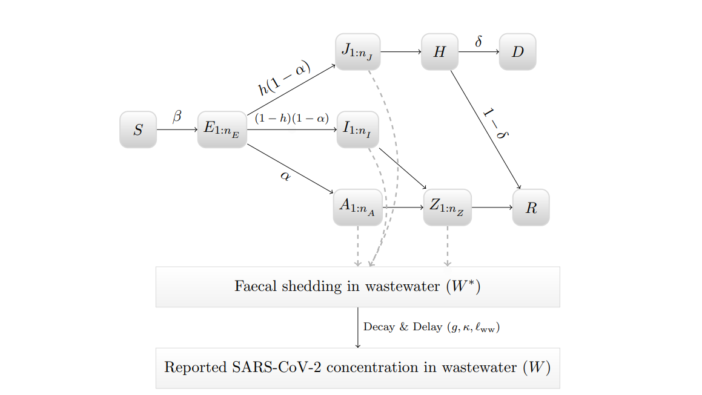

```{r, include = FALSE}
knitr::opts_chunk$set(
  collapse = TRUE,
  comment = "#>",
  fig.width = 6,
  fig.height = 4
)
```

```{r setup, echo = FALSE, message=FALSE, warning=FALSE}
library(ern)
library(tidyverse)
```

Viral concentration in wastewater has become a popular metric in tracking community transmission of respiratory illnesses. Infected individuals shed viral particles, which are then passed and collected at wastewater treatment facilities. Wastewater samples are then tested for viral concentration. Daily changes of viral concentration allow modellers to examine trends and estimate the effective reproductive number ($R_t$) over time.

## Estimating $R_t$ from wastewater {#sec-est-Rt}

The process we use to estimate $R_t$ from viral concentration in wastewater in `ern` is as follows:

1.  Pre-process the **time series of viral concentration in wastewater** to prepare for computing $R_t$. This step involves smoothing the rather noisy viral concentration data, as well as mapping from viral concentration to numbers of infections using a scaling factor.

2.  Specify a **fecal shedding distribution** which describes how infected individuals shed viral particles into wastewater over time. This article focuses on how a family of fecal shedding distributions were estimated for `ern` from literature.

3.  Perform a deconvolution of the pre-processed viral concentration time series using the fecal shedding distribution in order to obtain a **daily incidence time series** (see [Huisman et al, 2022](https://ehp.niehs.nih.gov/doi/10.1289/EHP10050)).

4.  Specify a **generation interval distribution**, which describes the time interval between an individual's infection and their transmission to another person. The way in which parameters for the family of generation intervals used in `ern` are estimated is described in the `distributions` vignette.

5.  Perform a deconvolution of the daily incidence time series with the generation interval distribution to obtain the $R_t$ **time series.**

## Fecal shedding kinetics

Individuals infected with respiratory illnesses (such as SARS-CoV-2, influenza, and RSV) shed viral particles into wastewater through their stool. In order to estimate the fecal shedding distributions needed for the $R_t$ calculation described [above](#sec-est-Rt), we must assume a model for the fecal shedding kinetics, which refers to the change of the individual's shedding amount in stools as a function of time since infection.

Research has been done to understand fecal shedding kinetics. In [Nourbakhsh *et al.* 2021](https://www.medrxiv.org/content/10.1101/2021.07.19.21260773v1), a SEIR compartmental model was created to simulate and forecast SARS-CoV-2 viral concentration in wastewater. In this model, SARS-CoV-2 fecal shedding in wastewater comes from individuals of different clinical profiles: infectious symptomatic (denoted as $I$), infectious asymptomatic (denoted as $A$), infectious symptomatic that requires hospitalization (denoted as $J$), and noninfectious (denoted as $Z$). A diagram illustrating how individuals move through the compartmental model and contribute to wastewater fecal shedding is shown below.

{width="90%"}

In this diagram, individuals begin in the susceptible compartment ($S$). Once exposed to SARS-CoV-2, they move into the exposed compartment ($E$) where they can then move into 3 unique compartments: infectious symptomatic ($I$), infectious asymptomatic ($A$), and infectious symptomatic that requires hospitalization ($J$). Individuals in the $I$ and $A$ compartments contribute to fecal shedding in their respective compartments along with when they enter the noninfectious compartment ($Z$). Individuals in the $J$ compartment do not enter into the $Z$ compartment as it is inferred that they do not contribute to fecal shedding while hospitalized ($H$). See [Nourbakhsh *et al.* 2021](https://www.medrxiv.org/content/10.1101/2021.07.19.21260773v1) for more details on the compartment model.

### Fitting a distribution based on fecal shedding kinetics

Within each of the 4 compartments that contribute to fecal shedding lies a number of subcompartments of $n_c$ (c: compartment name). According to [Nourbakhsh *et al.* 2021](https://www.medrxiv.org/content/10.1101/2021.07.19.21260773v1), each subcompartment sheds a different amount of viral SARS-CoV-2 into wastewater. The following figures illustrate the log fecal shedding kinetics of individuals in $I$, $A$, $J$, and $Z$ compartments.

```{r, echo=FALSE}
shed.i = data.frame(
  x = seq(from = 1, to = 12, by = 2),
  y = c(5, 7.30103, 7.083333, 6.677121, 6.30, 5.9)
)

plot(x = shed.i$x,
     y = shed.i$y,
     "b",
     main = "Fecal shedding kinetics: I compartment.\nMean days of shedding: 12",
     xlab = "days",
     ylab = "log viral load")

shed.a = data.frame(
  x = seq(from = 1, to = 10, by = 2),
  y = c(5,7.30103,7.083333,6.677121, 6.30)
)
plot(x = shed.a$x,
     y = shed.a$y,
     "b",
     main = "Fecal shedding kinetics: A compartment.\nMean days of shedding: 10",
     xlab = "days",
     ylab = "log viral load")

shed.j = data.frame(
  x = seq(from = 1, to = 8, by = 2),
  y = c(5,7.30103,7.083333,6.677121)
)
plot(x = shed.j$x,
     y = shed.j$y,
     "b",
     main = "Fecal shedding kinetics: J compartment.\nMean days of shedding: 8",
     xlab = "days",
     ylab = "log viral load")

shed.z = data.frame(
  x = seq(from = 1, to = 24, by = 4),
  y = c(5.40103,4.60103,3.90103,3.10103,2.10103,1.2)
)
plot(x = shed.z$x,
     y = shed.z$y,
     "b",
     main = "Fecal shedding kinetics: Z compartment.\nMean days of shedding: 24",
     xlab = "days",
     ylab = "log viral load")
```

Using these fecal shedding kinetics values for the 4 compartments, a general fecal shedding distribution for SARS-CoV-2 can be estimated for `ern` . This is first done by creating dataframes representing the various fecal shedding profiles of individuals exposed to SARS-CoV-2 ($I$ + $Z$, $A$ + $Z$, $J$).

```{r}
shed.symp = data.frame(
  x = c(seq(from = 1, to = 12, by = 2),seq(from = 13, to = 36, by = 4)),
  y = c(5, 7.30103, 7.083333, 6.677121, 6.30, 5.9, 5.40103,4.60103,3.90103,3.10103,2.10103,1.2)
)

shed.asymp = data.frame(
  x = c(seq(from = 1, to = 10, by = 2),seq(from = 11, to = 34, by = 4)),
  y = c(5, 7.30103, 7.083333, 6.677121, 6.30, 5.40103,4.60103,3.90103,3.10103,2.10103,1.2)
)

shed.severe = data.frame(
  x = seq(from = 1, to = 8, by = 2),
  y = c(5,7.30103,7.083333,6.677121)
)


```

Using these fecal shedding profiles, a mean fecal shedding distribution can be created by combining the 3 dataframes, and taking the daily mean viral shedding between the 3 shedding profiles.

```{r}
fec.l = list(
  shed.symp,
  shed.asymp,
  shed.severe
)

df = dplyr::bind_rows(fec.l) %>%
  dplyr::group_by(x) %>%
  dplyr::summarise(y = mean(y, na.rm=TRUE))

```

```{r, echo=FALSE}
plot(x = df$x,
     y = df$y,
     main = "Average fecal shedding kinetics distribution",
     xlab = "days",
     ylab = "log viral load", typ='b')
```

Using the [`stats4`](https://stat.ethz.ch/R-manual/R-patched/library/stats4/html/mle.html) package, a maximum likelihood estimation can be used to estimate a gamma distribution that fits the fecal shedding distribution along with standard error parameters. This gamma distribution can then be used in `ern` to obtain incidence estimates needed to generate $R_t$. The code below illustrates how the fitted fecal shedding gamma distribution for SARS-CoV-2 was obtained for `ern`.

```{r, warning=FALSE, message=FALSE}
get_gamma_fec <- function(df){
  log_likelihood = function(mean,shape){
    a = shape
    s = mean/shape
    return(-sum(df$y*(dgamma(df$x, shape = a, scale = s, log = TRUE))))
  }

  mle.res = stats4::mle(minuslogl = log_likelihood,
                                    start = list(mean = 14, shape = 2),
                                    nobs = nrow(df))
  
  res = stats4::summary(mle.res)
  ci = stats4::confint(object = mle.res, level = 0.68)
  
  f = list(
    dist = "gamma",
    mean  = res@coef[[1]],
    shape = res@coef[[2]],
    # we assume this parameter will be sampled with 
    # a normal distribution (hence 68%CI ~ 2 std dev):
    mean_sd  = (ci[1,2] - ci[1,1])/2, 
    shape_sd = (ci[2,2] - ci[2,1])/2,
    max = max(df$x)
  )

  return(f)
}

fec = get_gamma_fec(df)

fec
```

Below illustrates how the gamma distribution fits to the observed fecal shedding distribution for SARS-CoV-2.

```{r, echo=FALSE}
y = dgamma(df$x, shape = fec$shape, scale = fec$mean/fec$shape)
plot(x = df$x,
     y = y/sum(y), 
     'l',
     main = "Fitted fecal shedding kinetics distribution",
     xlab = "days",
     ylab = "log viral load (normalized)")
points(x = df$x, y = df$y/sum(df$y))
```

## Parameter values

### SARS-CoV-2

```{r, echo=FALSE}
tribble(
  ~parameter,           ~`value type`,                 ~`value`,
    "fecal distribution mean",  "mean",              fec$mean,
    "",                   "standard deviation", fec$mean_sd,
    "fecal distribution shape", "mean",              fec$shape,
    "",                   "standard deviation", fec$shape_sd,
) %>%
  knitr::kable(
    digits = 1
  )
```

### Other respiratory illnesses

In future releases, fecal shedding parameter estimates for RSV and influenza will be estimated using fecal kinetics data from literature. SARS-CoV-2 fecal shedding estimates will be routinely updated as more literature data is obtained.
